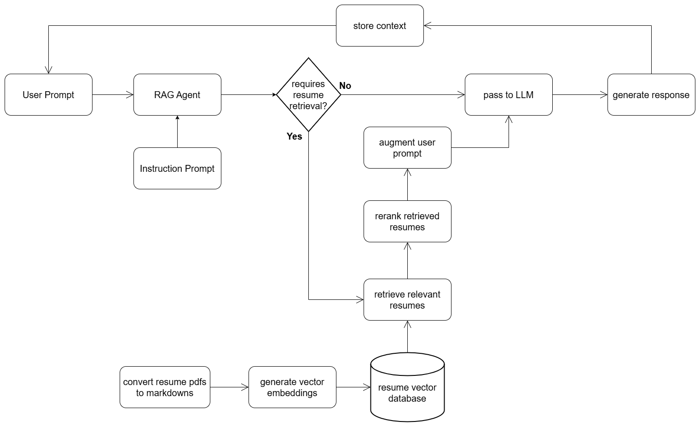

# Resume Sorter

An intelligent, AI-powered resume sorting and retrieval system that enables conversational interaction with a collection of candidate resumes leveraging Agentic-RAG.

## Overview

This project implements a sophisticated resume sorting agent that combines semantic search with natural language processing to help recruiters and hiring managers efficiently find the most relevant candidates from a large pool of resumes.

### Key Technical Approaches

**1. Local PDF to Markdown Conversion**
- PDF to markdown conversion is performed using a locally run open-source model from [marker-pdf](https://github.com/VikParuchuri/marker)
- This approach ensures data privacy and eliminates dependency on external PDF processing APIs
- The conversion preserves document structure and formatting for better downstream processing

**2. No-Chunking Strategy for Resume Storage**
- Each resume is stored as a separate row in the RAG database **without chunking**
- This design choice prevents content fragmentation and ensures no important information is lost during retrieval
- Complete resume context is always available for relevance scoring and candidate evaluation

**3. Hybrid Search with LinearCombinationReranker**
- Utilizes `LinearCombinationReranker` to leverage both **semantic search** and **full-text search** capabilities
- The reranker combines vector similarity scores with keyword matching scores to compute final relevance scores
- This hybrid approach ensures both conceptually similar and keyword-matching resumes are surfaced effectively

**4. Conversational Context Management**
- Conversation context is stored and maintained across interactions
- Enables users to have an open, multi-turn dialogue with the agent about retrieved resumes
- Supports human-in-the-loop resume sorting, allowing users to refine queries, ask follow-up questions, and collaborate with the AI in the decision-making process

## Workflow

The system follows this workflow to process and retrieve resumes:



**Workflow Steps:**
1. **PDF Conversion**: Resume PDFs are converted to markdown format using the marker-pdf library
2. **Vector Embeddings**: Converted markdown resumes are processed to generate vector embeddings
3. **Database Storage**: Resumes and their embeddings are stored in a LanceDB vector database
4. **User Interaction**: Users submit queries through the RAG agent interface
5. **Retrieval Decision**: The agent determines if resume retrieval is needed based on the query
6. **Hybrid Search**: If needed, relevant resumes are retrieved using hybrid search (semantic + full-text)
7. **Reranking**: Retrieved resumes are reranked using LinearCombinationReranker
8. **Context Augmentation**: User prompts are augmented with retrieved resume content
9. **Response Generation**: LLM generates responses based on the augmented context
10. **Context Storage**: Conversation history is maintained for multi-turn interactions

## Features

- **Intelligent Resume Retrieval**: Finds relevant candidates based on natural language job requirements
- **Conversational Interface**: Interactive CLI for querying and discussing resumes
- **Hybrid Search**: Combines semantic understanding with keyword matching
- **Context-Aware Responses**: Maintains conversation history for nuanced follow-up queries
- **Configurable Reranking**: Adjustable weights for semantic vs. full-text search
- **LLM-Cost-Optimization**: PDFs are converted to markdown format locally to reduce token consumption of LLM calls

## Setup

### Prerequisites

- Python 3.8 or higher
- pip package manager

### Installation

1. **Clone the repository**
   ```bash
   git clone <repository-url>
   cd resume-sorter
   ```

2. **Install dependencies**
   ```bash
   pip install -r requirements.txt
   ```

3. **Configure environment variables**

   Create a `.env` file in the project root by copying the example file:
   ```bash
   cp .env.example .env
   ```

   Edit the `.env` file and configure the following variables:
   ```env
   MODEL=openai                          # or 'gemini' for Google's embedding model
   OPENAI_API_KEY=<your-openai-api-key>  # Required if MODEL=openai
   GOOGLE_API_KEY=<your-gemini-api-key>  # Required if MODEL=gemini
   DB_PATH=./resume-rag-db               # Path to LanceDB database
   TABLE_NAME=resume_knowledge           # Name of the database table
   RESUME_DIR=./resumes_in_md            # Directory containing markdown resumes
   RELEVANCE_SCORE_THRESHOLD=0.2         # Minimum relevance score for results
   ```

4. **Prepare your resumes**

   Create a `resumes` directory and place your PDF resumes inside:
   ```bash
   mkdir resumes
   # Copy your PDF resumes into the resumes/ directory
   ```

5. **Initialize the database**

   Run the setup script to convert PDFs to markdown and populate the database:
   ```bash
   python setup.py
   ```

   This will:
   - Convert all PDFs in `./resumes` to markdown format in `./resumes_in_md`
   - Create embeddings for each resume
   - Store resumes in the LanceDB vector database

## Usage

### Running the Resume Sorter Agent

Start the interactive CLI:

```bash
python main.py
```

### Example Interactions

```
>: Find me candidates with Python and machine learning experience
>> I found 5 relevant candidates with Python and machine learning expertise...

>: Which of them have experience with PyTorch?
>> Among the previously retrieved candidates, 3 have PyTorch experience...

>: Tell me more about the candidate with the most ML experience
>> Based on the resumes, [Candidate Name] appears to have the most extensive ML background...

>: exit
```

### Query Examples

- **Skills-based search**: "Find candidates proficient in React, Node.js, and AWS"
- **Experience-based search**: "Show me senior developers with 5+ years of experience"
- **Domain-specific search**: "Find data scientists with healthcare industry experience"
- **Follow-up questions**: "Which of these candidates have published research papers?"
- **Comparative queries**: "Compare the top 3 candidates' technical backgrounds"

### Configuration Parameters

You can adjust the agent's behavior in `main.py`:

```python
resume_retriever_agent_deps = ResumeRetrieverAgentDependency(
    rag_table_name=rag_db.TABLE_NAME,  # Database table name
    limit=10,                          # Maximum number of resumes to retrieve
    reranker_weight=0.7                # Weight for hybrid search (0-1)
                                       # Higher = more semantic, Lower = more keyword-based
)
```

### Message History

The agent maintains a rolling window of the last 5 conversation turns to provide context-aware responses while managing token usage efficiently.

## Project Structure

```
resume-sorter-ferdous/
├── agents/
│   └── resume_sorter_agent.py      # Main agent logic
├── helpers/
│   ├── pdf_to_md.py                # PDF to Markdown conversion
│   └── rag_db.py                   # Database and retrieval functions
├── models/
│   ├── resume.py                   # Resume data model
│   └── resume_retriever_agent_dependency.py
├── tools/
│   └── retrieve_similar_resumes_tool.py  # Resume retrieval tool
├── resumes/                        # Place PDF resumes here
├── resumes_in_md/                  # Generated markdown resumes
├── resume-rag-db/                  # LanceDB database (auto-generated)
├── main.py                         # CLI entry point
├── setup.py                        # Database initialization script
├── requirements.txt                # Python dependencies
└── .env                            # Environment configuration
```

## Technical Stack

- **Framework**: Pydantic AI
- **Vector Database**: LanceDB
- **Embeddings**: OpenAI text-embedding-ada-002 or Google Gemini embeddings
- **PDF Processing**: marker-pdf (open-source, local processing)
- **Reranking**: LinearCombinationReranker (hybrid search)
- **Search Types**: Semantic search + Full-text search
